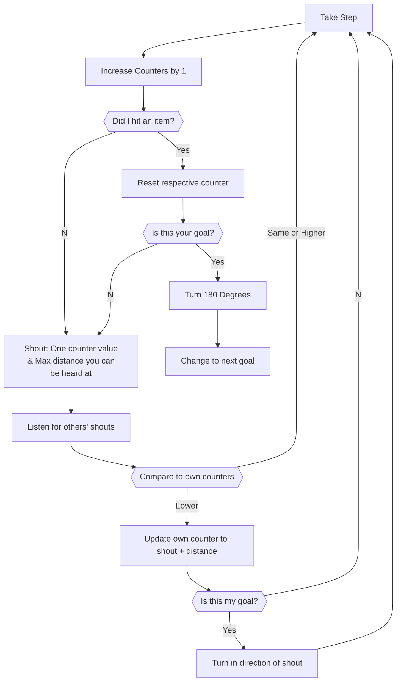

# Senses

## Radiation

Includes all types of radiated energy

### Look

### Emit

## Chemical

### Sniff

### Stink

## Thermal

## Contact / Pressure

## Position / Orientation

# Algorithms

## Ant Colony Optimization (ACO)

Based on entities leaving pheromone trails. https://en.wikipedia.org/wiki/Ant_colony_optimization_algorithms

## Particle Swarm Optimization (PSO)

Each particle moves based on it its own best solution vs a globally decided solution.
https://en.wikipedia.org/wiki/Particle_swarm_optimization

## Bees Algorithm

Bees explore the search space by selecting potential solutions and sharing information about them.
https://en.wikipedia.org/wiki/Bees_algorithm

## Artificial Bee Colony (ABC)

Uses different types of entities to achieve overall goals. Scouts explore new solutions randomly. Onlookers evaluate solutions. Workers execute chosen solutions.
https://en.wikipedia.org/wiki/Artificial_bee_colony_algorithm

## Firefly Algorithm

Fireflies are attracted to each other's light. Brigher lights represent better solutions.
https://en.wikipedia.org/wiki/Firefly_algorithm

## Bacterial Foraging Optimization (BFO)

Bacteria move in search of nutrients and use chemical signals to decide how to adjust position.
https://www.sciencedirect.com/science/article/abs/pii/S0925231220319172
https://www.ncbi.nlm.nih.gov/pmc/articles/PMC7354797/

## Bird Swarm Algorithm

Relies on alignment, cohesion, and separation rules for birds in a swarm. Results in flocking behaviors.
https://www.researchgate.net/publication/281189951_A_new_bio-inspired_optimisation_algorithm_Bird_Swarm_Algorithm

## Glowworm Swarm Optimization (GSO)

Attract and repel based on solution qualtity. (Similar to firefly?)
https://www.researchgate.net/publication/259472313_Glowworm_Swarm_Optimization_GSO_Algorithm_for_Optimization_Problems_A_State-of-the-Art_Review

## Distance Counter

1. Take a step
2. Increase all counters by 1
3. If you bump into an item
    4. reset the respective counter
    5. if this is the target destination,
        6. turn 180 degrees
        7. change next destination objective in your head
4. shout value of one of your counters plus the max distance you can be heard at
5. listen to what others are shouting
6. if you hear a value less than your counter
    7. update your own counter
    8. if you want to go to this objective
        9. turn in the direction of the shouting

## Termites (Mound-building)

1. Make a bar of grains
2. When the bar has reached a certain height, see if there is a higher bar nearby, if there is one, leave your bar and continue working on a higher one.
3. When the bar has reached an even larger size, see if there is a bar nearby that can be connected to yours
    4. if not, leave your bar and look for another suitable bar nearby
    5. if yes, connect it to yours
4. start over
